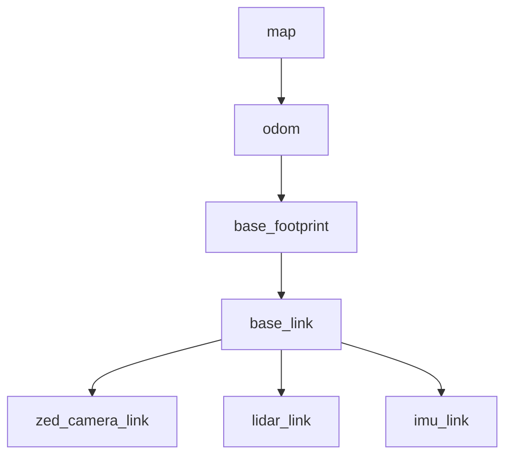
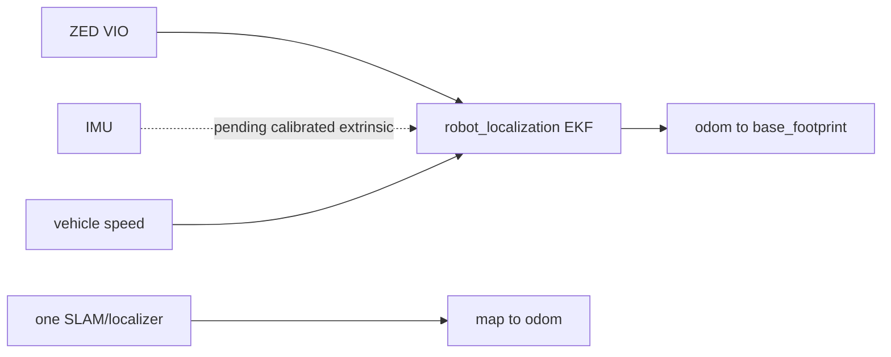
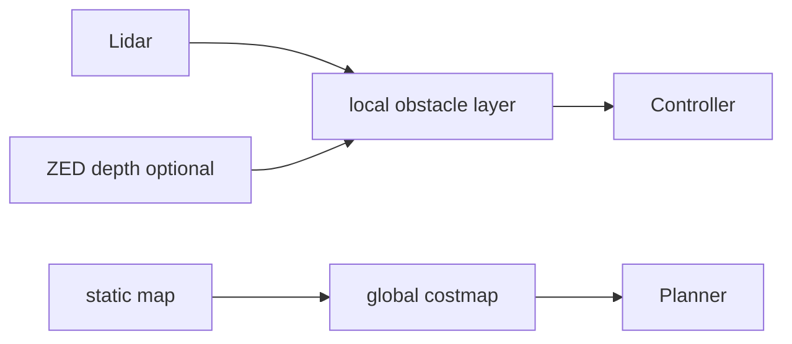
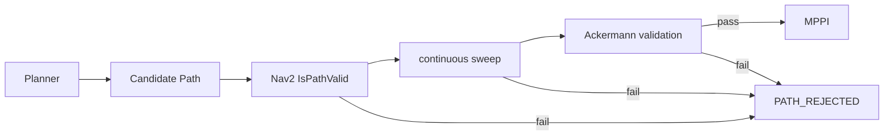
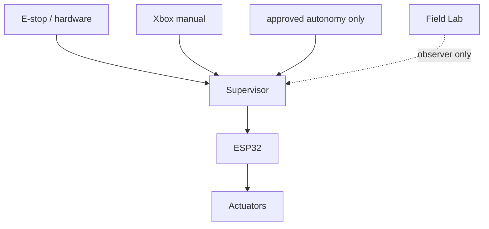
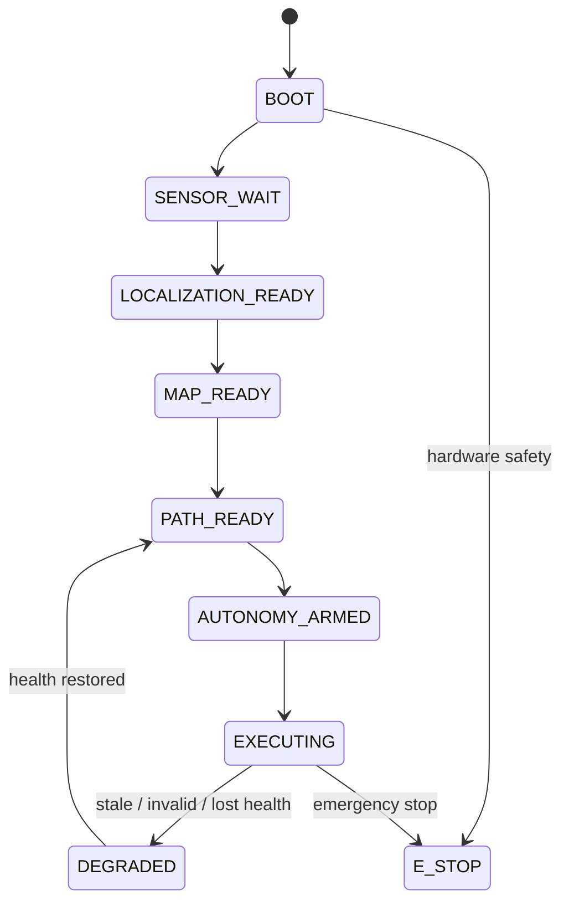
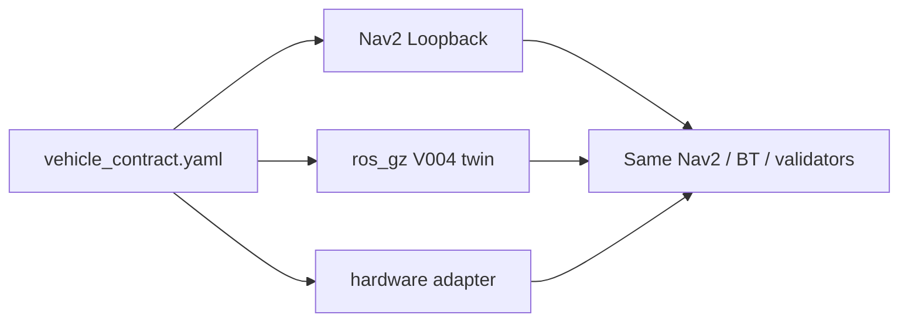

# LAKSA Navigation Architecture V2

Status: proposed architecture; no V2 node is production-qualified.

V2 has one robot contract, one TF authority per edge, one local odometry
contract, and a fail-closed path gate. Hardware drivers, simulation, and
offline replay supply the same ROS interfaces; they do not fork navigation
logic.

```text
ZED VIO / measured speed -> robot_localization EKF -> odom -> base_footprint
body attitude adapter  -> base_footprint -> base_link
SLAM/localization      -> one authority       -> map  -> odom
LiDAR / depth          -> Nav2 layered costmaps
costmaps -> State Lattice primary / Hybrid comparison -> candidate Path
candidate -> Nav2 IsPathValid -> swept collision -> Ackermann gate
accepted Path -> MPPI Ackermann -> Collision Monitor -> authority supervisor
                                                    -> ESP32 safety boundary
Xbox manual ------------------------------------------------> supervisor
RTAB-Map RGB-D -> 3D reconstruction -> Field Lab (observer only)
```

The legacy recovered mapping runtime stays frozen. V2 adapts it behind
contracts; it does not overwrite its launch/configuration files.

## Contracts at a glance















See `docs/architecture/adr/` for decisions, `NAVIGATION_V2_INTERFACE_CONTRACTS.md`
for interfaces, and `NAVIGATION_V2_TEST_PLAN.md` for evidence gates.

## Gate order

G1 canonical robot / TF is complete. G2 supplies only local planar odometry:
one `robot_localization` EKF, raw ZED VIO pose, measured VESC Vx when
calibrated, and no global TF. G3 compares 2D mapping/localization approaches;
only then do costmaps, planner, and controller gates begin.
